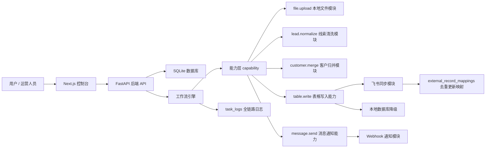

# AI 自动化控制台 Lite

这是一个面向 AI 自动化工具管理的轻量控制台。项目目标不是做一个单一脚本工具，而是做一个可以承载多个可插拔能力模块的后台：网站本体负责模块管理、配置管理、工作流运行、任务日志、状态看板和失败降级，具体业务能力通过模块接入。

当前已实现一个真实业务闭环：

```text
上传 CSV -> 线索清洗 -> 客户归并 -> 同步飞书线索明细表 -> 同步飞书客户表 -> 查看上传历史和任务日志
```

## 项目价值

很多业务自动化工具一开始都不是完美的：有些工具会失效，有些接口会变化，有些流程会被替换。这个项目把零散脚本整理成一个可管理的平台，让工具可以被启用、停用、替换和追踪。

核心思路：

- 平台不直接绑定某个具体工具，而是调用 `table.write`、`lead.normalize`、`customer.merge` 这样的能力。
- 飞书只是 `table.write` 的一个实现，未来可以替换成数据库、Airtable、Notion 或 CRM。
- 模块失败不应该拖垮整个流程，系统会记录 `partial_success` 并保留本地数据。
- 每次调用都有任务日志和上传历史，方便追溯、排错和复盘。

## 核心功能

- 仪表盘：查看今日任务数、成功数、部分成功数、失败数、平均耗时和异常模块。
- 功能管理：查看模块，启用/停用模块，测试连接，查看健康状态。
- MCP 管理：登记 HTTP MCP Server，发现 tools/list，保存 capability 映射，手动调用 tools/call 并查看调用日志。
- 配置中心：维护飞书等模块配置和密钥。
- CSV 上传：上传平台询盘数据，触发线索清洗和客户归并。
- 主图生成：一键创建商品主图任务，调用 `image.generate` 能力生成主图并保存到本地资产库。
- 上传历史：查看上传过哪些 CSV、处理多少行、同步到哪些表、新增/更新多少记录。
- 工作流运行：查看每次工作流状态、耗时和输出摘要。
- 任务日志：查看每个步骤的模块、能力、输入摘要、输出摘要、错误和重试次数。
- 数据中心：查看本地线索表和客户表。
- 消息通知：工作流 `partial_success` 或 `failed` 时可通过 `message.send` webhook 通知外部系统。

## MCP 能力管理

当前项目已经具备 MCP 管理后台 MVP：

```text
MCP Server -> MCP Client -> 平台 capability -> 调用日志
```

已支持：

- 添加 HTTP MCP Server endpoint
- 启用 / 停用 / 删除 MCP Server
- 通过 `initialize` + `tools/list` 发现 MCP 工具
- 将 MCP tool 映射为平台 capability
- 通过 `tools/call` 手动调用 MCP 工具
- 记录 MCP 调用输入、输出、耗时、状态和错误

当前限制：

- Lite 版暂只支持 HTTP JSON-RPC MCP endpoint
- 暂不托管 stdio MCP Server 本地进程
- MCP 工具还没有自动编排进现有线索工作流，需要后续把 capability 映射接入工作流引擎

## 商品主图生成

后台的“主图生成”页面提供第一版商品图工作流：

```text
填写商品名称 / 分类 / 提示词 / 主图比例
  ↓
创建 product_tasks 任务
  ↓
调用 image.generate
  ↓
保存 generated_assets
  ↓
记录 workflow_runs 和 task_logs
```

如果“图片生成”模块未配置真实 API，会生成一张明确标记的本地占位主图，工作流状态为 `partial_success`。这样可以先验证任务、日志、资产预览链路；配置真实图片 API 后，再生成正式主图。

图片生成模块配置项：

```text
apiKey
baseUrl
model
```

模型模块配置项：

```text
apiKey
baseUrl=https://api.siliconflow.cn/v1/chat/completions
model=Qwen/Qwen3.6-27B
authMode=bearer
providerMode=chat
```

主图详情页生成现在会先调用“模型”模块做提示词反推，再调用“图片生成”模块出图：

```text
产品图 -> image.describe -> 产品图描述
参考图 -> image.describe -> 参考图风格描述
产品图描述 + 参考图风格描述 + 主图提示词 -> prompt.compose -> 最终提示词
产品图 + 最终提示词 -> image.generate -> 主图结果
```

推荐在飞书主图详情页生成表中增加追溯字段：

```text
产品图描述
参考图风格描述
最终提示词
```

这三个字段不是生图必需字段；如果飞书表里还没创建，平台会先回写主图结果，再把追溯字段回写失败记录为 `partial_success`。

## 技术栈

- 前端：Next.js、React、TypeScript
- 后端：FastAPI、Python
- 数据库：SQLite
- 部署：Docker Compose
- 集成：飞书开放 API / 飞书多维表格
- 演示版：Python 标准库 HTTP Server + 静态页面

## 架构设计



能力层示例：

```text
table.write -> 飞书同步模块
table.write -> 本地数据库模块
table.write -> 未来 CRM / Airtable / Notion 模块
message.send -> Webhook 通知模块
```

## 当前业务规则

- 线索明细表：一条客户咨询等于一条线索。
- 客户表：同一客户归并为一条客户记录。
- 客户 ID：优先使用联系方式；没有联系方式时使用客户名称 + 地区。
- 线索去重：来源平台 + 询盘时间 + 客户名称 + 商品标题 + 原始咨询内容。
- 一个客户可以有多条线索，客户表只汇总，不吞掉具体问题。
- 重复上传同一批 CSV 时，本地按线索去重，飞书通过 `external_record_mappings` 更新已有记录，避免重复新增。

## 工作流状态

- `success`：本地处理和飞书同步都成功。
- `partial_success`：本地处理成功，但飞书同步失败、配置缺失或模块停用；数据仍保留在本地。
- `failed`：CSV 解析、清洗、归并等核心步骤失败。

## 快速启动

Windows 双击启动正式版：

```text
start-formal.bat
```

访问：

```text
http://127.0.0.1:3000
```

停止正式版：

```text
stop-formal.bat
```

命令行启动：

```powershell
cd F:\plan
docker compose up --build -d
```

如果 Docker 拉取镜像源超时，但本地已有镜像缓存，可以使用：

```powershell
docker compose up --build --pull never -d
```

如果需要通过 Clash 代理构建或访问飞书 API，可以先设置代理环境变量再启动。宿主机命令使用 `127.0.0.1:7897`；Docker 容器里访问宿主机代理通常使用 `host.docker.internal:7897`：

```powershell
cd F:\plan
$env:HTTP_PROXY="http://host.docker.internal:7897"
$env:HTTPS_PROXY="http://host.docker.internal:7897"
$env:NO_PROXY="localhost,127.0.0.1,backend,frontend"
docker compose up --build --pull never -d
```

如果 Docker 构建时仍然无法连接代理，需要在 Clash 里开启“允许局域网 / Allow LAN”，或者在 Docker Desktop 的代理设置中填写宿主机代理地址。

## 飞书配置

第一层在“配置中心”里选择“飞书同步”，只填写机器人/应用凭证：

- `appId`
- `appSecret`

第二层在“飞书监听”页里登记多维表格：

- `Base`：填写 Base 名称和 `appToken`。一个飞书应用凭证可以管理多个 Base。
- `飞书表配置`：在某个 Base 下登记 `tableId`，并选择用途，例如 `CSV 提交任务表`、`线索明细表`、`客户表`、`图片生成任务表`、`主图详情页生成表`。
- `监听器`：绑定一张任务表，选择监听类型，例如 `CSV 线索导入`、`图片生成` 或 `主图详情页生成`，再配置字段映射、状态值，并可打开/关闭轮询扫描。

当前监听采用轮询模式，不是 webhook 事件模式。打开监听后，后台会按间隔扫描已登记的任务表，只处理状态等于“待处理”的记录，并把处理结果、工作流ID、错误信息、处理时间回写到同一条记录。

线索同步目标不再写死在模块配置里，而是通过飞书表用途决定：

- 用途 `lead_detail` -> 线索明细表
- 用途 `customer` -> 客户表
- 用途 `csv_intake` -> CSV 提交任务表监听入口
- 用途 `product_task` -> 图片生成任务表监听入口
- 用途 `product_detail_task` -> 主图详情页生成表监听入口

图片生成任务表的字段名不需要固定，但需要在监听器里映射到平台字段：

- 商品名称字段
- 商品分类字段
- 产品图字段（主图详情页生成使用）
- 提示词字段
- 比例字段
- 参考图片字段
- 状态字段
- 结果字段
- 错误字段
- 工作流ID字段
- 处理时间字段

参考图片字段建议使用飞书附件/图片字段。对于普通“图片生成”监听器，参考图会作为图生图参考传给图片 API；对于“主图详情页生成”监听器，参考图会先交给“模型”模块反推出风格描述，再把产品图和最终提示词交给图片 API。结果字段建议使用飞书附件/图片字段，平台会生成图片、上传为飞书 `bitable_image`，再把 `file_token` 回写到该字段。

`主图详情页生成` 是当前新增的第一阶段工作流：读取产品图、参考图、主图提示词和主图比例，先反推产品描述与参考图风格，再生成并回写主图结果。详情页图和详情页文案会在后续阶段扩展，不影响当前主图生成闭环。

也可以通过 `.env` 注入：

```text
FEISHU_APP_ID=
FEISHU_APP_SECRET=
FEISHU_BITABLE_APP_TOKEN=
FEISHU_BITABLE_TABLE_ID=
FEISHU_CUSTOMER_TABLE_ID=
FEISHU_INTAKE_TABLE_ID=
MESSAGE_WEBHOOK_URL=
```

`.env` 里的旧字段会在启动时自动迁移成默认 Base、线索明细表、客户表和 CSV 提交任务表配置，用于兼容旧版本。

注意：不要把真实 `.env`、数据库文件或上传文件提交到 Git。

## 飞书机器人通知

通知模块可以直接使用飞书群自定义机器人：

1. 在飞书群里添加“自定义机器人”。
2. 复制机器人 webhook，格式通常类似 `https://open.feishu.cn/open-apis/bot/v2/hook/...`。
3. 在网站“功能管理”里启用“消息通知”模块。
4. 在“配置中心”选择“消息通知”，把 webhook 填到 `webhookUrl`。
5. 工作流出现 `partial_success` 或 `failed` 时，会自动发送飞书文本通知。

如果机器人开启了安全设置，建议先使用“自定义关键词”，并把关键词设置为 `AI自动化平台`。当前 Lite 版尚未实现飞书机器人签名校验。

## 演示入口

样例 CSV：

```text
samples/sample_leads.csv
```

推荐演示顺序：

1. 打开仪表盘，说明这是 AI 自动化控制台。
2. 打开功能管理，展示模块启停和健康状态。
3. 打开配置中心，说明飞书作为 `table.write` 能力提供方。
4. 上传 `samples/sample_leads.csv`。
5. 打开上传历史，查看本次上传、处理行数、飞书新增/更新结果。
6. 打开任务日志，查看 `file.upload`、`lead.normalize`、`customer.merge`、`table.write` 的调用记录。
7. 打开数据中心，展示线索和客户归并结果。
8. 启用消息通知模块并配置 webhook，展示异常结果可触发 `message.send`。
9. 停用飞书模块后再跑一次，展示 `partial_success`、本地降级和通知日志。

更完整的演示说明见 [docs/demo-guide.md](docs/demo-guide.md)。

## 项目结构

```text
backend/
  app/
    main.py              FastAPI API 入口
    database.py          SQLite 建表、迁移、种子数据
    lead_workflow.py     兼容入口，转发到 tools/lead_import
    feishu_client.py     兼容入口，转发到 tools/feishu_sync
    intake_listener.py   兼容入口，转发到 tools/feishu_intake
  tools/
    lead_import/         CSV 线索清洗、客户归并、能力调用日志
    feishu_sync/         飞书多维表格 API 客户端
    feishu_intake/       飞书 CSV 提交监听
    _template/           新工具模板
frontend/
  app/
    page.tsx             后台控制台壳层和视图切换
    components/          前端通用组件，例如状态标签、空状态
    lib/                 前端通用工具，例如 API 请求、时间/状态格式化
    views/               各后台页面视图
    globals.css          控制台样式
static/
  index.html             无前端构建依赖的 demo 页面
samples/
  sample_leads.csv       演示 CSV
docs/
  demo-guide.md          演示流程
  interview-script.md    面试讲解稿
  project-highlights.md  项目亮点
```

## 核心数据表

- `modules`：功能模块表
- `capabilities`：能力表
- `module_configs`：模块配置表
- `workflows`：工作流定义表
- `workflow_runs`：工作流运行记录
- `task_logs`：单步任务日志
- `files`：文件记录
- `leads`：线索表
- `customers`：客户表
- `feishu_bases`：飞书多维表格 Base 注册表
- `feishu_tables`：飞书表配置表，记录 tableId 和业务用途
- `intake_listener_state`：飞书任务表监听器配置和状态
- `intake_runs`：每次监听扫描历史
- `intake_record_results`：每条飞书任务记录的处理结果
- `external_record_mappings`：本地记录与外部系统记录映射
- `product_tasks`：商品生成任务表
- `generated_assets`：生成资产表

## 求职展示定位

这个项目可以这样介绍：

> 我做了一个 AI 自动化控制台 Lite，用来管理可插拔的自动化工具。平台支持模块启停、配置管理、工作流运行、日志追溯、失败降级、消息通知和 Docker 部署，并实现了一个 CSV 线索清洗、客户归并、飞书同步的真实业务闭环。

更多面试表达见 [docs/interview-script.md](docs/interview-script.md)，项目亮点见 [docs/project-highlights.md](docs/project-highlights.md)。

## 工具目录长期规范

项目后续按“平台核心 + 可插拔工具”维护：

```text
backend/app/
  平台核心：API、配置、数据库、调度、日志、状态、注册中心
  兼容入口：保留旧 import，不承载具体业务实现

backend/tools/
  工具目录：每个子文件夹代表一个独立工具或工作流，真实业务代码放在这里
```

已建立的工具目录：

```text
backend/tools/lead_import/      CSV 线索清洗归并工作流
backend/tools/feishu_sync/      飞书多维表格同步能力
backend/tools/feishu_intake/    飞书 CSV 提交监听能力
backend/tools/image_generate/   图片生成能力，未配置 API 时提供本地占位降级
backend/tools/model_provider/   通用模型能力，提供 image.describe、text.generate、prompt.compose
backend/tools/product_main_image/ 商品主图生成工作流
backend/tools/_template/        新工具模板，不会被注册为真实工具
```

每个真实工具至少包含：

```text
manifest.json   工具说明、版本、类型、提供能力、依赖能力、配置项
README.md       工具用途、运行方式、删除影响
```

主系统通过 `GET /api/tools` 扫描 `backend/tools/*/manifest.json`。
新增工具时先放入独立子目录，再通过能力层接入，避免把业务逻辑继续堆进主系统文件。

## 自动化测试

本项目现在增加了 pytest，用来保护三个最核心的后台机制：

- `task_queue`：验证任务不会重复入队、领取任务会变成 running、图片和 CSV 并发上限生效、临时失败会自动回到 pending 等待重试。
- `workflow_registry`：验证工作流来自 `backend/tools/*/manifest.json`，并且工作流或模块停用后不会继续执行。
- `capability_registry`：验证 `image.generate`、`image.describe` 这类能力能找到正确工具，模块停用时会阻止调用。

本地运行：

```powershell
cd F:\plan
.\.venv\Scripts\python.exe -m pip install -r backend\requirements-dev.txt
.\.venv\Scripts\python.exe -m pytest -q
```

前端检查：

```powershell
cd F:\plan
npm --prefix frontend run typecheck
npm --prefix frontend run build
```

GitHub Actions 已加入 `.github/workflows/tests.yml`。以后推送到 GitHub 或创建 PR 时，会自动安装后端依赖、运行 pytest、编译检查 `backend/`，并安装前端依赖后运行 TypeScript 检查。

## 安全配置

后端默认只允许本机前端访问 API：

```text
http://127.0.0.1:3000
http://localhost:3000
```

如果部署到服务器或局域网访问，需要通过环境变量增加允许的前端地址：

```powershell
$env:CORS_ORIGINS="http://127.0.0.1:3000,http://localhost:3000,https://your-domain.example"
```

临时测试可以设置 `CORS_ORIGINS=*`，但不建议公网部署时全开放。

后台也支持一层简单管理 token。默认不设置时，本机开发不需要登录；设置 `ADMIN_TOKEN` 后，除 `/api/health` 外的后台 API 都必须带 token。

正式版 Docker 只需要设置一个值：

```powershell
$env:ADMIN_TOKEN="换成你自己的管理密码"
docker compose up --build --pull never -d
```

前端构建时会把同一个 token 写入 `NEXT_PUBLIC_ADMIN_TOKEN`，后台页面请求 API 时会自动带上 `X-Admin-Token`。

注意：这是 Lite 版的简单保护，适合个人后台或内网测试；公网多人使用时，后续应该升级成真正的登录、会话和权限系统。
