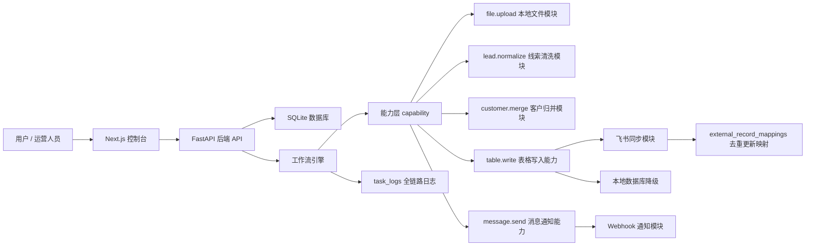

# AI 自动化后台平台 MVP

这是一个面向 AI 自动化工具管理的后台平台 MVP。项目目标不是做一个单一脚本工具，而是做一个可以承载多个可插拔能力模块的控制台：网站本体负责模块管理、配置管理、工作流运行、任务日志、状态看板和失败降级，具体业务能力通过模块接入。

当前已实现一个真实业务闭环：

```text
上传 CSV -> 线索清洗 -> 客户归并 -> 同步飞书线索明细表 -> 同步飞书客户表 -> 查看上传历史和任务日志
```

## 项目价值

很多业务自动化工具一开始都不是完美的：有些工具会失效，有些接口会变化，有些流程会被替换。这个项目把零散脚本整理成一个可管理的平台，让工具可以被启用、停用、替换和追踪。

核心思路：

- 平台不直接绑定某个具体工具，而是调用 `table.write`、`lead.normalize`、`customer.merge` 这样的能力。
- 飞书只是 `table.write` 的一个实现，未来可以替换成数据库、Airtable、Notion 或 CRM。
- 模块失败不应该拖垮整个流程，系统会记录 `partial_success` 并保留本地数据。
- 每次调用都有任务日志和上传历史，方便追溯、排错和复盘。

## 核心功能

- 仪表盘：查看今日任务数、成功数、部分成功数、失败数、平均耗时和异常模块。
- 功能管理：查看模块，启用/停用模块，测试连接，查看健康状态。
- 配置中心：维护飞书等模块配置和密钥。
- CSV 上传：上传平台询盘数据，触发线索清洗和客户归并。
- 上传历史：查看上传过哪些 CSV、处理多少行、同步到哪些表、新增/更新多少记录。
- 工作流运行：查看每次工作流状态、耗时和输出摘要。
- 任务日志：查看每个步骤的模块、能力、输入摘要、输出摘要、错误和重试次数。
- 数据中心：查看本地线索表和客户表。
- 消息通知：工作流 `partial_success` 或 `failed` 时可通过 `message.send` webhook 通知外部系统。

## 技术栈

- 前端：Next.js、React、TypeScript
- 后端：FastAPI、Python
- 数据库：SQLite
- 部署：Docker Compose
- 集成：飞书开放 API / 飞书多维表格
- 演示版：Python 标准库 HTTP Server + 静态页面

## 架构设计



能力层示例：

```text
table.write -> 飞书同步模块
table.write -> 本地数据库模块
table.write -> 未来 CRM / Airtable / Notion 模块
message.send -> Webhook 通知模块
```

## 当前业务规则

- 线索明细表：一条客户咨询等于一条线索。
- 客户表：同一客户归并为一条客户记录。
- 客户 ID：优先使用联系方式；没有联系方式时使用客户名称 + 地区。
- 线索去重：来源平台 + 询盘时间 + 客户名称 + 商品标题 + 原始咨询内容。
- 一个客户可以有多条线索，客户表只汇总，不吞掉具体问题。
- 重复上传同一批 CSV 时，本地按线索去重，飞书通过 `external_record_mappings` 更新已有记录，避免重复新增。

## 工作流状态

- `success`：本地处理和飞书同步都成功。
- `partial_success`：本地处理成功，但飞书同步失败、配置缺失或模块停用；数据仍保留在本地。
- `failed`：CSV 解析、清洗、归并等核心步骤失败。

## 快速启动

Windows 双击启动正式版：

```text
start-formal.bat
```

访问：

```text
http://127.0.0.1:3000
```

停止正式版：

```text
stop-formal.bat
```

命令行启动：

```powershell
cd F:\plan
docker compose up --build -d
```

如果 Docker 拉取镜像源超时，但本地已有镜像缓存，可以使用：

```powershell
docker compose up --build --pull never -d
```

## 飞书配置

在网站的“配置中心”里选择“飞书同步”，填写：

- `appId`
- `appSecret`
- `appToken`
- `leadTableId`
- `customerTableId`

也可以通过 `.env` 注入：

```text
FEISHU_APP_ID=
FEISHU_APP_SECRET=
FEISHU_BITABLE_APP_TOKEN=
FEISHU_BITABLE_TABLE_ID=
FEISHU_CUSTOMER_TABLE_ID=
MESSAGE_WEBHOOK_URL=
```

注意：不要把真实 `.env`、数据库文件或上传文件提交到 Git。

## 演示入口

样例 CSV：

```text
samples/sample_leads.csv
```

推荐演示顺序：

1. 打开仪表盘，说明这是 AI 自动化控制台。
2. 打开功能管理，展示模块启停和健康状态。
3. 打开配置中心，说明飞书作为 `table.write` 能力提供方。
4. 上传 `samples/sample_leads.csv`。
5. 打开上传历史，查看本次上传、处理行数、飞书新增/更新结果。
6. 打开任务日志，查看 `file.upload`、`lead.normalize`、`customer.merge`、`table.write` 的调用记录。
7. 打开数据中心，展示线索和客户归并结果。
8. 启用消息通知模块并配置 webhook，展示异常结果可触发 `message.send`。
9. 停用飞书模块后再跑一次，展示 `partial_success`、本地降级和通知日志。

更完整的演示说明见 [docs/demo-guide.md](docs/demo-guide.md)。

## 项目结构

```text
backend/
  app/
    main.py              FastAPI API 入口
    database.py          SQLite 建表、迁移、种子数据
    lead_workflow.py     CSV 线索清洗、客户归并、能力调用日志
    feishu_client.py     飞书 API 客户端
frontend/
  app/
    page.tsx             后台控制台主界面
    globals.css          控制台样式
static/
  index.html             无前端构建依赖的 demo 页面
samples/
  sample_leads.csv       演示 CSV
docs/
  demo-guide.md          演示流程
  interview-script.md    面试讲解稿
  project-highlights.md  项目亮点
```

## 核心数据表

- `modules`：功能模块表
- `capabilities`：能力表
- `module_configs`：模块配置表
- `workflows`：工作流定义表
- `workflow_runs`：工作流运行记录
- `task_logs`：单步任务日志
- `files`：文件记录
- `leads`：线索表
- `customers`：客户表
- `external_record_mappings`：本地记录与外部系统记录映射
- `product_tasks`：商品生成任务表，预留
- `generated_assets`：生成资产表，预留

## 求职展示定位

这个项目可以这样介绍：

> 我做了一个 AI 自动化后台平台 MVP，用来管理可插拔的自动化工具。平台支持模块启停、配置管理、工作流运行、日志追溯、失败降级、消息通知和 Docker 部署，并实现了一个 CSV 线索清洗、客户归并、飞书同步的真实业务闭环。

更多面试表达见 [docs/interview-script.md](docs/interview-script.md)，项目亮点见 [docs/project-highlights.md](docs/project-highlights.md)。
